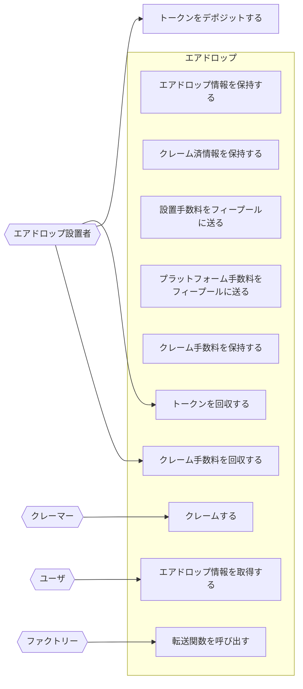

# アクター

- エアドロップ
  - エアドロップ情報を保持する
  - クレーム済情報を保持する
  - 設置手数料をフィープールに送る
  - プラットフォーム手数料をフィープールに送る
  - クレーム手数料を保持する
  - 転送関数を保持する
- エアドロップ設置者
  - トークンを回収する
  - トークンをデポジットする
  - クレーム手数料を回収する
- クレーマー
  - クレームする
- ファクトリー
  - 転送関数を呼び出す
- ユーザ
  - エアドロップ情報を取得する

## ユースケース図

