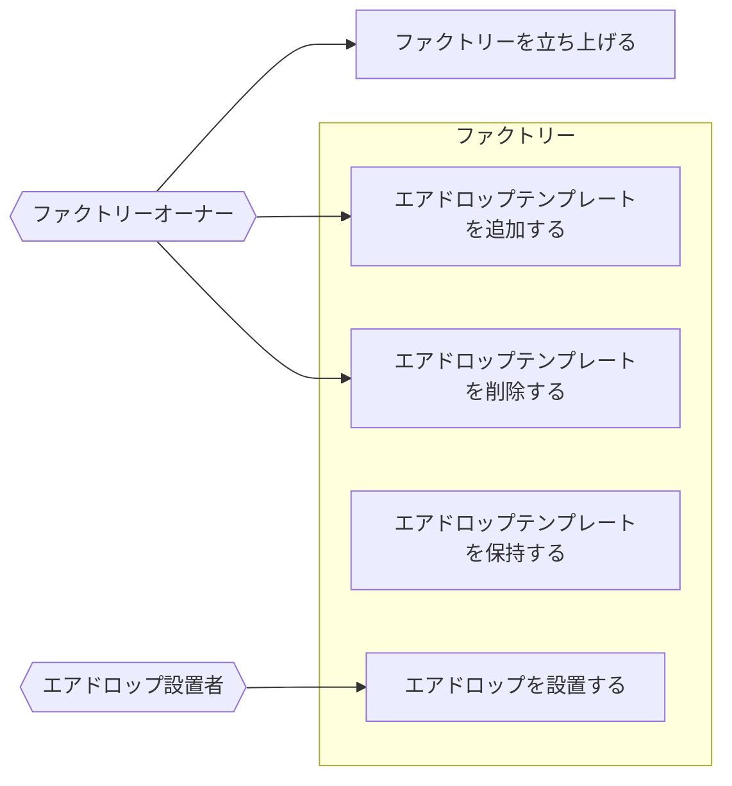

# アクター

- ファクトリーオーナー
  - ファクトリーを立ち上げる
  - エアドロップテンプレートを追加する
  - エアドロップテンプレートを削除する
- ファクトリー
  - エアドロップテンプレートを保持する
- エアドロップ設置者
  - エアドロップを設置する

# ユースケース図

```mermaid
graph LR
    fow{{ファクトリーオーナー}}
    sow{{エアドロップ設置者}}

    fow-->FOW1[ファクトリーを立ち上げる]
    fow-->FOW2[エアドロップテンプレートを追加する]
    fow-->FOW3[エアドロップテンプレートを削除する]

    F1[エアドロップテンプレートを保持する]
    F2[エアドロップを設置する]

    sow-->F2

    subgraph ファクトリー
        F1
        F2
        FOW2
        FOW3
    end

```
