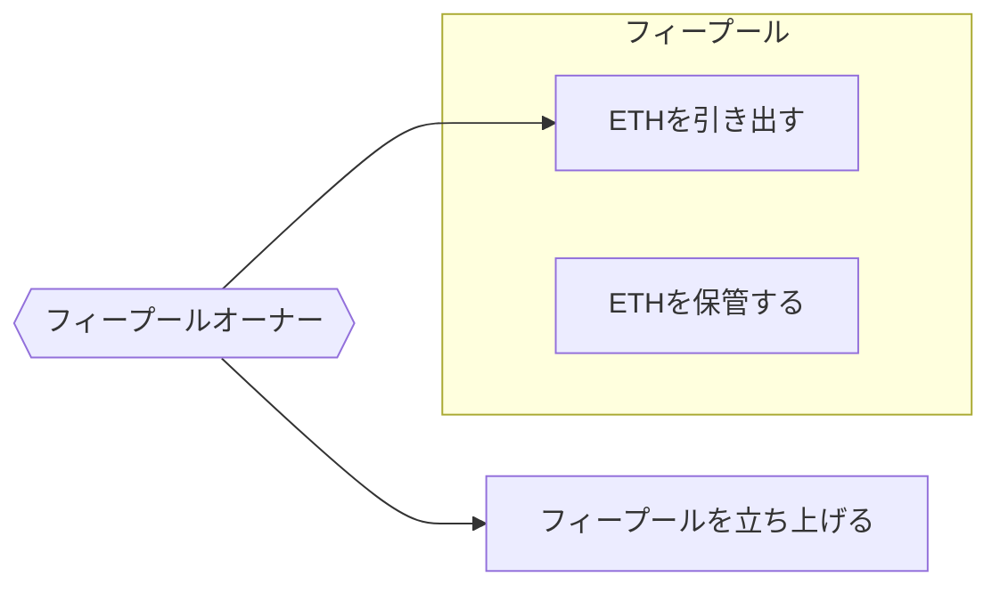

# アクター

- フィープールオーナー
  - フィープールを立ち上げる
  - ETH を引き出す
- フィープール
  - トークンを保管する

# ユースケース図

```mermaid
graph LR
    fpow{{フィープールオーナー}}

    fpow-->FPOW1[フィープールを立ち上げる]
    fpow-->FPOW2[ETHを引き出す]

    F1[ETHを保管する]

    subgraph フィープール
        F1
        FPOW2
    end

```
