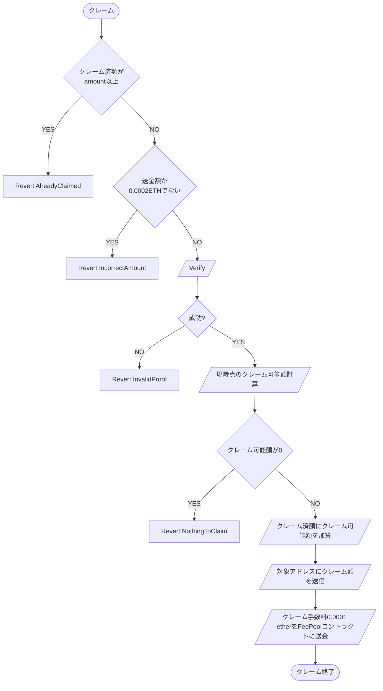

# LinearVesting

## 概要

エアドロップの割当情報から作成したマークルツリーを活用し、マークルルートの検証によってトークンの割当額を対象アドレスに対して送信する。
設置者は設置手数料を支払い、任意の線形べスティング期間を指定してエアドロップを設置する。
クレーマーは割当額をべスティング期間に応じてクレーム時点でのクレーム可能額を受取ることができる。

### 親コントラクト

[MerkleAirdropBase](../MerkleAirdropBase/index.md)

### 定数

#### uint256 public constant claimFee = 0.0001 ether

クレーム時にクレーマーが支払う手数料。エアドロップコントラクトに蓄積され、エアドロップ設置者によって引き出し可能

#### uint256 public constant registrationFee = 0.01 ether;

エアドロップ設置者がエアドロップ設置時に支払う手数料。FeePool コントラクトに蓄積され、FeePool オーナーによって引き出し可能

### 変数

#### address public token;

エアドロップ対象トークン

#### uint256 public vestingStart;

べスティングの開始タイムスタンプ

#### uint256 public vestingDuration;

べスティング期間

#### mapping(address => uint256) public claimedAmount;

各アドレスのクレーム済額を管理するマッピング

### 関数

#### コンストラクタ

```kotlin
constructor(
    address factory_,
    address feePool_
) BaseTemplate(factory_, feePool_)
```

| 引数名    | 型      | 概要                         | 制約 |
| --------- | ------- | ---------------------------- | ---- |
| factory\_ | address | Factory コントラクトアドレス | -    |
| feePool\_ | address | FeePool コントラクトアドレス | -    |

---

#### initialize

Factory から minimum-proxy パターンでデプロイされた後呼び出される初期化関数。設置手数料 として 0.01 ether の送金が必要。
Factory からのみ呼出し可能。

```kotlin
function initialize(
    address owner_,
    bytes32 merkleRoot_,
    address token_,
    uint256 vestingDuration_,
    uint256 depositAmount_
) external payable onlyFactory returns (address, uint256, address)
```

※ 0.01 ether (registrationFee)の送金が必須

| 引数名            | 型      | 概要                                      | 制約                  |
| ----------------- | ------- | ----------------------------------------- | --------------------- |
| owner\_           | address | エアドロップ設置者のアドレス              | 0 アドレスでないこと  |
| merkleRoot\_      | bytes32 | マークルルート                            | -                     |
| token\_           | address | エアドロップ対象の ERC20 トークンアドレス | 0 アドレスでないこと- |
| vestingDuration\_ | uint256 | べスティング期間を秒単位で指定            | 0 でない              |
| depositAmount\_   | uint256 | 設置時に同時にデポジットするトークン額    | -                     |

---

### initializeTransfer

初期化後に後呼び出される送金用の関数。送金者は Factory に対して approve することで初期化と同時に指定額の送金が可能。
Factory からの delegatecall でのみ呼出し可能。

```kotlin
function initializeTransfer(
    address token_,
    uint256 amount_,
    address to_
) external payable onlyDelegateFactory
```

---

### withdrawClaimFee

エアドロップコントラクトに送金された claimFee を引き出す。
エアドロップ設置者のみ呼出し可能。

```kotlin
function withdrawClaimFee() external onlyOwner
```

### getAirdropInfo

エアドロップコントラクトの情報を返す view 関数

```kotlin
function getAirdropInfo() external view returns (AirdopInfo memory)
```

### claim

対象のノード index, アドレス、クレーム額、検証に必要なノードの配列を検証し、正しい場合は対象アドレスにクレーム時点でのクレーム可能額を送信する。クレーム手数料 として 0.0001 ether、プラットフォーム手数料として 0.0001 ether で合計 0.0002 ether の送金が必要。

※ 0.0002 ether の送金が必須

各アカウントのクレーム時点でのクレーム可能額 a は下記で表される。

$$
a = \min\left(\frac{t - t_0}{d}, 1\right) \cdot a_{\text{total}} - a_{\text{claimed}}
$$

$
a_{\text{total}}: アカウントへの割当額
$

$
a_{\text{claimed}}: アカウントのクレーム済額
$

$
d: べスティング期間
$

$
t_0: べスティング開始タイムスタンプ
$

$
t: クレーム時点のタイムスタンプ
$

```kotlin
function claim(
    uint256 index_,
    address account_,
    uint256 amount_,
    bytes32[] calldata merkleProof_
) external payable
```

| 引数名        | 型                 | 概要                            | 制約 |
| ------------- | ------------------ | ------------------------------- | ---- |
| index\_       | uint256            | 対象ノードの index              | -    |
| account\_     | address            | 対象アドレス                    | -    |
| amount\_      | uint256            | 対象のクレーム額                | -    |
| merkleProof\_ | bytes32[] calldata | 対象の検証に必要な ノードの配列 | -    |

---

### クレームフロー


