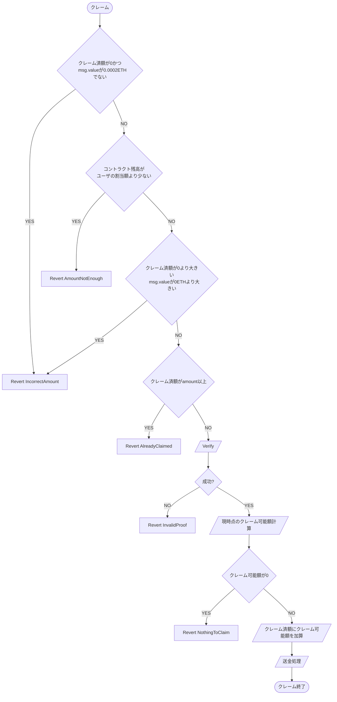

### Claim フローチャート

```mermaid
flowchart TD
    START([クレーム]) --> A{クレーム済額が0かつ
    msg.valueが0.0002ETHでない}
    A --YES--> R1[Revert IncorrectAmount]
    A --NO-->B{コントラクト残高が
    ユーザの割当額より少ない}
    B --YES-->R5[Revert AmountNotEnough]
    B --NO--> C{クレーム済額が0より大きい
    msg.valueが0ETHより大きい}
    C --YES--> R1
    C --NO--> F{クレーム済額がamount以上}
    F --YES--> R3[Revert AlreadyClaimed]
    F --NO--> D[/Verify/]
    D --> E{成功?}
    E --NO--> R2[Revert InvalidProof]
    E --YES--> G[/現時点のクレーム可能額計算/]
    G --> H{クレーム可能額が0}
    H --YES-->R4[Revert NothingToClaim]
    H --NO--> J[/クレーム済額にクレーム可能額を加算/]
    J -->K[/送金処理/]
    K --> END([クレーム終了])
```
