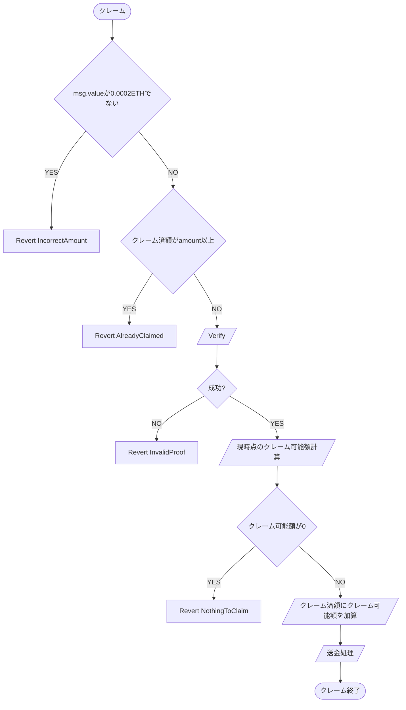

### Claim フローチャート

```mermaid
flowchart TD
    START([クレーム]) --> A{msg.valueが0.0002ETHでない}
    A --YES--> R1[Revert IncorrectAmount]
    A --NO--> B{クレーム済額がamount以上}
    B --YES--> R2[Revert AlreadyClaimed]
    B --NO--> C[/Verify/]
    C --> D{成功?}
    D --NO--> R3[Revert InvalidProof]
    D --YES--> E[/現時点のクレーム可能額計算/]
    E --> F{クレーム可能額が0}
    F --YES-->R4[Revert NothingToClaim]
    F --NO--> G[/クレーム済額にクレーム可能額を加算/]
    G -->K[/送金処理/]
    K --> END([クレーム終了])
```
