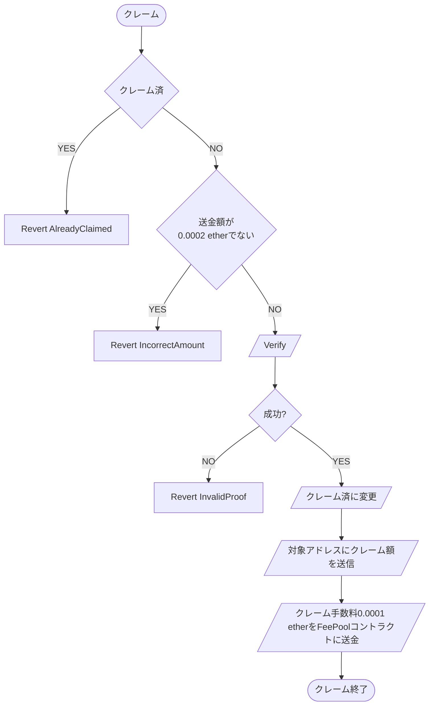

# Standard

## 概要

エアドロップの割当情報から作成したマークルツリーを活用し、マークルルートの検証によってトークンの割当額を対象アドレスに対して送信する。
設置者は設置手数料を支払いエアドロップを設置することができる。
クレーマーはクレーム手数料とプラットフォーム手数料を支払い、割当額を一括でクレームすることができる。

### 親コントラクト

[MerkleAirdropBase](../MerkleAirdropBase/index.md)

### 定数

#### uint256 public constant claimFee = 0.0001 ether

クレーム時にクレーマーが支払う手数料。エアドロップコントラクトに蓄積され、エアドロップ設置者によって引き出し可能

#### uint256 public constant registrationFee = 0.01 ether;

エアドロップ設置者がエアドロップ設置時に支払う手数料。FeePool コントラクトに蓄積され、FeePool オーナーによって引き出し可能

### 変数

#### address public token;

エアドロップ対象トークン

#### mapping(uint256 => uint256) private claimedBitMap;

各ノードのクレーム済ステータスを管理するビットマップ

### 関数

#### コンストラクタ

```kotlin
constructor(
    address factory_,
    address feePool_
) MerkleAirdropBase(factory_, feePool_)
```

| 引数名    | 型      | 概要                         | 制約 |
| --------- | ------- | ---------------------------- | ---- |
| factory\_ | address | Factory コントラクトアドレス | -    |
| feePool\_ | address | FeePool コントラクトアドレス | -    |

---

#### initialize

Factory から minimum-proxy パターンでデプロイされた後呼び出される初期化関数。設置手数料 として 0.01 ether の送金が必要。
Factory からのみ呼出し可能。

```kotlin
function initialize(
    address owner_,
    bytes32 merkleRoot_,
    address token_,
    uint256 depositAmount_
) external payable onlyFactory returns (address, uint256, address)
```

※ 0.01 ether (registrationFee)の送金が必須

| 引数名          | 型      | 概要                                      | 制約                  |
| --------------- | ------- | ----------------------------------------- | --------------------- |
| owner\_         | address | エアドロップ設置者のアドレス              | 0 アドレスでないこと  |
| merkleRoot\_    | bytes32 | マークルルート                            | -                     |
| token\_         | address | エアドロップ対象の ERC20 トークンアドレス | 0 アドレスでないこと- |
| depositAmount\_ | uint256 | 設置時に同時にデポジットするトークン額    | -                     |

---

### initializeTransfer

初期化後に後呼び出される送金用の関数。送金者は Factory に対して approve することで初期化と同時に指定額の送金が可能。
Factory からの delegatecall でのみ呼出し可能。

```kotlin
function initializeTransfer(
    address token_,
    uint256 amount_,
    address to_
) external payable onlyDelegateFactory
```

---

### withdrawDepositedToken

デポジットしてあるトークンを全額引出す。
エアドロップ設置者のみ呼出し可能。

```
function withdrawDepositedToken() external onlyOwner
```

---

### withdrawClaimFee

エアドロップコントラクトに送金された claimFee を引き出す。
エアドロップ設置者のみ呼出し可能。

```kotlin
function withdrawClaimFee() external onlyOwner
```

### isClaimed

指定 index がクレーム済かどうかを返却する view 関数

```kotlin
function isClaimed(uint256 index\_) public view returns (bool)
```

| 引数名  | 型      | 概要               | 制約 |
| ------- | ------- | ------------------ | ---- |
| index\_ | uint256 | 対象ノードの index | -    |

---

### \_setClaimed

指定 index に対してクレーム済ステータスをセットする private 関数

```kotlin
function _setClaimed(uint256 index_) private
```

| 引数名  | 型      | 概要               | 制約 |
| ------- | ------- | ------------------ | ---- |
| index\_ | uint256 | 対象ノードの index | -    |

---

### claim

対象のノード index, アドレス、クレーム額、検証に必要なノードの配列を検証し、正しい場合は対象アドレスにクレーム額を送信する。クレーム手数料 として 0.0001 ether、プラットフォーム手数料として 0.0001 ether で合計 0.0002 ether の送金が必要。

※ 0.0002 ether の送金が必須

```kotlin
function claim(
    uint256 index_,
    address account_,
    uint256 amount_,
    bytes32[] calldata merkleProof_
) external payable
```

| 引数名        | 型                 | 概要                            | 制約 |
| ------------- | ------------------ | ------------------------------- | ---- |
| index\_       | uint256            | 対象ノードの index              | -    |
| account\_     | address            | 対象アドレス                    | -    |
| amount\_      | uint256            | 対象のクレーム額                | -    |
| merkleProof\_ | bytes32[] calldata | 対象の検証に必要な ノードの配列 | -    |

---

### クレームフロー


